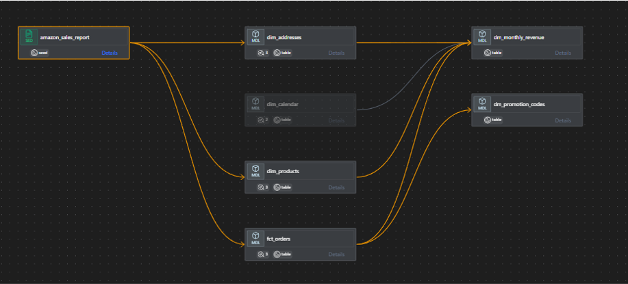
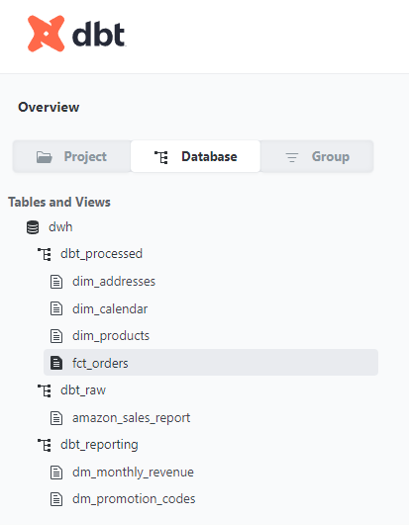
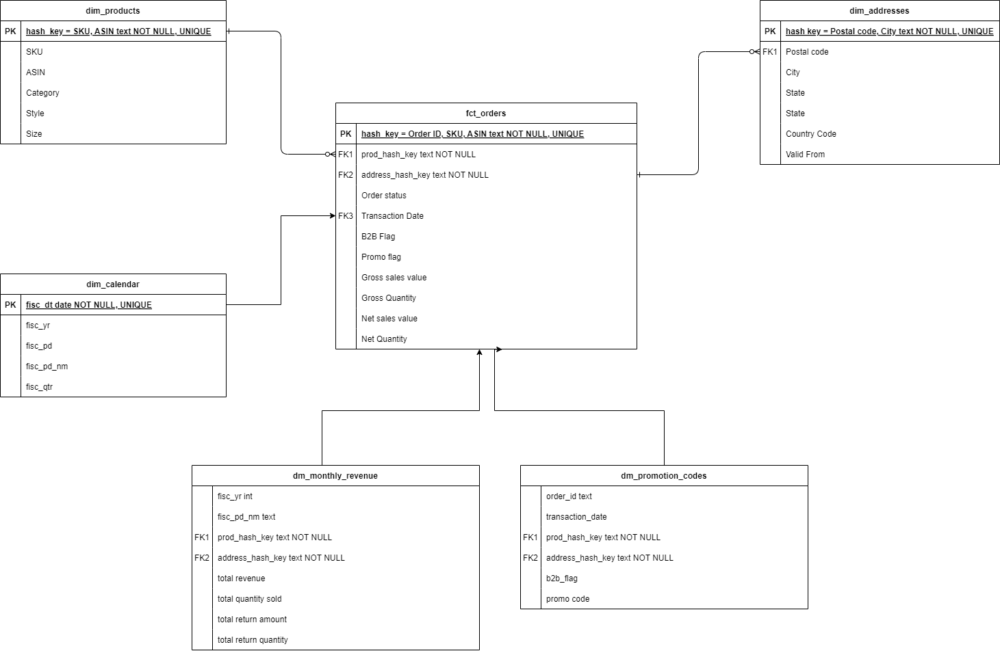
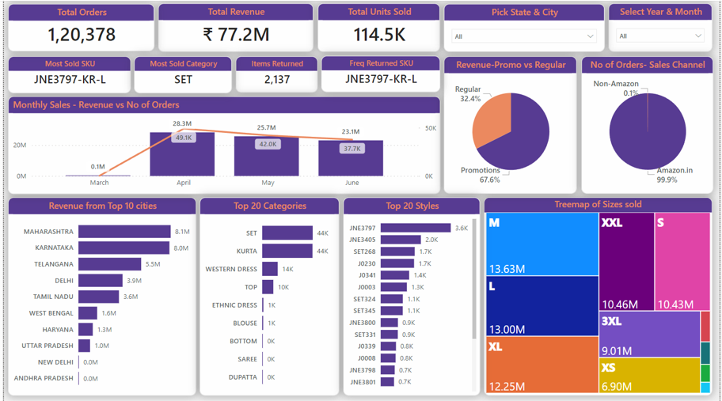
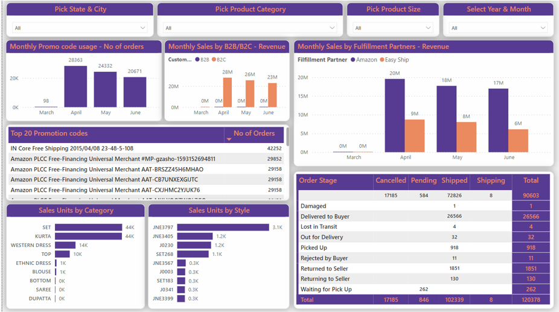
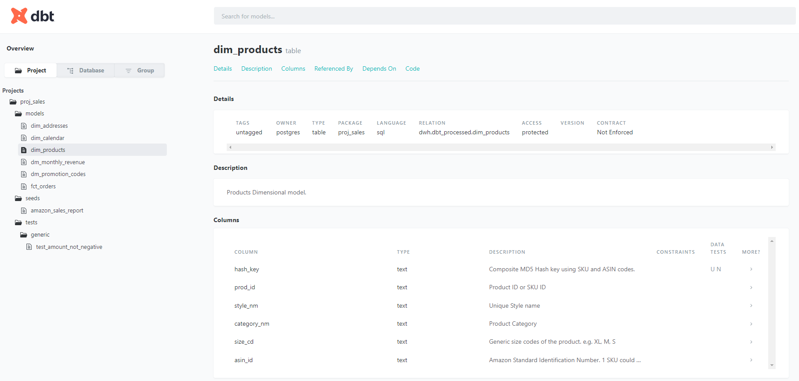

# Fedex - Analytics Engineer Assessment

This repository contains source data, source code and Power BI Dashboard created for the assessment.

    
<h2 style="display: inline-block">Table of Contents</h2>

    <ol>
        <li>
            <a href="#the-case">The Case</a>
        </li>
        <li>
            <a href="#the-solution">The Solution</a>
        </li>
        <li>
            <a href="#lineage-diagram">Lineage Diagram</a>
        </li>
        <li>
            <a href="#entity-relationship-diagram">Entity Relationship Diagram</a>
        </li>
        <li>
            <a href="#power-bi-report-snapshots">Power BI Report snapshots</a>
        </li>
        <li>
            <a href="#dbt-build-snapshots">dbt Build snapshots</a>
        </li>
        <li>
            <a href="#dbt-docs-preview">dbt Docs Preview</a>
        </li>

## The case
You are working for an online retail company that sells products on Amazon. Our
marketeers will have many questions about the performance of our sales on Amazon to better understand the customer and take the appropriate actions. To better facilitate our marketeers, you are asked to build a simple data warehouse using Kimball dimensional modeling that will make it easy for marketeers to perform analysis on.

## The Solution
### Tools used
This assignment has been completed using the following tools:
<ul>
    <li>PostreSQL database - locally hosted</li>
    <li>dbt core</li>
    <li>Power BI Desktop</li>
    <li>DBeaver CE</li>
    <li>draw.io</li>
</ul>

### Data Assessment and Modelling
After exploring the dataset, the following Data Models could be defined:
<ul>
<li><h4>Orders – created as fct_orders</h4>
        This is the transactional data from the Sales report which is at the centre of this Kimball Star Schema model. Model contains fact fields along with supporting fields for Shipping, Promotion etc and foreign keys for other Dimensional models.
    </li>
    <li><h4>Addresses – created as dim_addresses</h4>
        The Sales report consists of Postal codes, City, State and Country fields. Postal Code has a 1:Many relationship (common pattern) with the other Address related fields. Hence, to normalize the Orders data, created this Dimensional model and added this foreign key to the fact model.
    </li>
    <li><h4>Products – created as dim_products</h4>
        Sales report contains detailed Product attributes up to SKU/ASIN code level along with supporting Product descriptions like Style, Size, Category. All Product Attributes have been moved to this Dimensional model and added a foreign key to the fact model.
    </li>
    <li><h4>Calendar – created as dim_calendar</h4>
        Sales report has data at Order Date level. Calendar model was created to store descriptive details like Month, Year, Quarter.
    </li>
    </ul>

</b>

Note: 
<ul>
<li>The given Sales report does not include specific information about the end-consumer or the business partner, hence this rules out the need for a dedicated Customer model. Customer related fields like B2B flag or Sales Channel are hence retained in fct_orders model.</li>
<li>Similarly, Shipping details like Tracking ID is not included in the dataset and hence a dedicated Shipping model was not setup. Fulfillment, Shipping status and service level are thus included in fct_orders model.</li>
</ul>

</b>

Apart from the 4 data models specified above, 2 datamarts have been built on top of Orders fact model (fct_orders):
<ul>
<li>dm_monthly_revenue - Datamart built on top of fct_orders by aggregating Sales revenue and Sales units at a Monthly level. Also contains foreign keys to dim_products and dim_addresses.</li>
<li>dm_promotion_codes - Datamart built on top of fct_orders by unnesting the concatenated Promotion codes by Order ID. Also contains foreign keys to dim_products and dim_addresses.</li>
</ul>

### Lineage Diagram
Generated using dbt core Lineage tool

### Entity Relationship Diagram
#### Database design
<ul>
<li>Raw data is stored in dbt_raw schema.</li>
<li>Processed data models are stored in dbt_processed schema.</li>
<li>Data marts created for BI Consumption and has denormalized structure are stored in dbt_reporting schema.</li>
</ul>

#### ERD of Data Models and Data marts

### Power BI Report snapshots
Power BI report is available in Amazon Sales Visualization.pbix in the root folder.

#### Page 1 : Overview
<ul>
<li>Contains overview of the Sales Value and Quantity to help with a quick preview for users. 
<li>Cards on top announce the Total Orders, Revenue, Best selling SKU and SKU returned frequently.
<li>Page contains slicers to pick Year & Month and State & City.
</ul>

#### Page 2 : Detailed
<ul>
<li>Contains visuals about the Order Shipping status, Promotion codes usage, Revenue split between partners and Consumer demographic. 
<li>Page contains slicers to pick Year & Month along with State & City and Product attributes.
</ul>

### dbt Build Snapshots

<ul>
<li>Steps 1 is Model creation, independant of source data</li>
<li>Step 2 is seeding of the Source data into Postgres database.</li>
<li>Step 3 through 8 is dbt run to create the Models in their relevant schema and materialization preference.</li>
<li>Steps 9 through 21 consists of various Data Quality tests performed on the Models.</li>
</ul>

### dbt Docs Preview
Docs is available in proj_sales/target/index.html
Catalog is available in proj_sales/target/catalog.json

